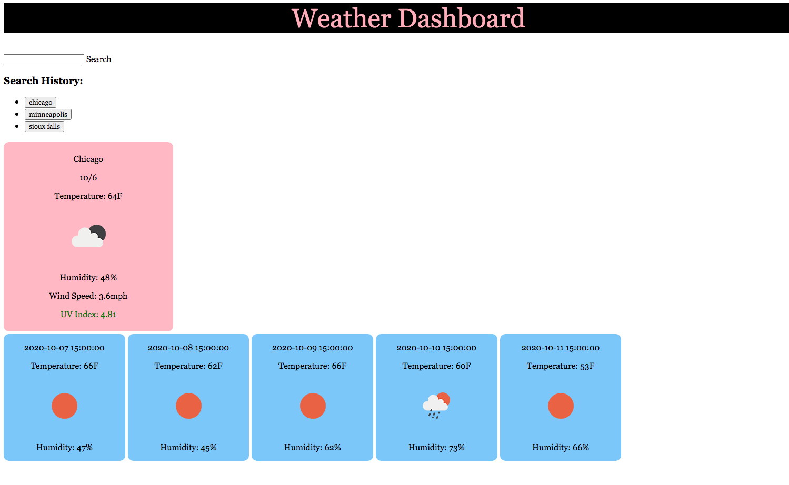

# Weather_Dashboard

Description:

This weather dashboard allows you to search for a city and view it's current weather and the five day forecast. You can search for multiple cities and use the buttons generated to toggle between their weather forecasts. 

Links: 
Repository Link - https://github.com/kyliemegan24/Weather_Dashboard

Gitpages link - https://kyliemegan24.github.io/Weather_Dashboard/

Usage Instructions:

Type in the city of your choosing and click "search." Click the buttons generated below the search bar to view the cities you've previously searched for.

Installation: N/A

Credits/Thanks :

Thanks to my partner Elijah Flanders for brainstorming with me to build this app.

License info: None